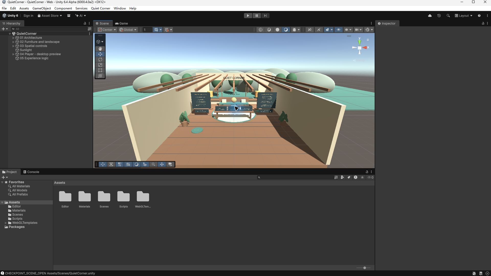

# Quiet Corner

An early interactive environment for the DDES9902 design checkpoint. This is a desktop-browser Unity WebGL prototype, not a tested VR application.

## Scene to open

**QuietCorner** at `Assets/Scenes/QuietCorner.unity`.

Open the repository root as a Unity project. The verified editor version is **6000.4.0a2**. The project uses built-in Unity modules; there are no external paid assets. Load the scene and press Play.

## Navigation and interaction

| Input | Action |
| --- | --- |
| W/A/S/D or arrow keys | Move through the room |
| Hold right mouse and move | Look around |
| Q / E | Turn by 30 degrees |
| Left click a labelled control | Activate it |
| Click a floor pad | Move to the indicated location |
| 1 / 2 / 3 | Toggle light / sound / visual guide |
| Esc or STOP ALL | Stop sound and guide |
| R | Reset interaction state |
| Home | Return to the entrance |

Recognisable landmarks include the central glowing orb, the three-control console, the window-side bench, garden view, lanterns and floor destinations. Warm/cool light, independently switchable sound and an optional 48-second visual guide provide clear state changes.

## Scene view evidence



Captured from the Unity editor with the Scene tab selected and Play mode off.

## Building WebGL

Install Web Build Support for this Unity version. Use `File > Build Profiles > Web` and the saved scene above, or use `Quiet Corner > Build WebGL checkpoint`. The custom HTML template contains loading feedback and control instructions. Gzip with Unity's decompression fallback supports ordinary static hosts such as GitHub Pages and itch.io.

Reproducible CLI build:

```text
Unity.exe -batchmode -quit -projectPath <project-folder> -buildTarget WebGL -executeMethod QuietCornerCheckpoint.BuildWebGL -qc-webgl-output <output-folder> -logFile <build-log>
```

Upload the contents of the WebGL output folder, with `index.html` at the hosting root. A local `file://` URL is not a published playable link.

## Implementation and scope

The scene uses primitive geometry, materials, TextMesh labels, a CharacterController, physics raycasts and C# state logic. Audio is generated procedurally. Sound is muted by default; the guide is optional and can be stopped. No personal data are collected.

The initial scene and code were generated with AI assistance and should be reviewed, understood and adapted by the student in accordance with course rules. Automated functionality checks do not constitute peer testing. The project does not claim completion of all EZPZ chapter exercises, validation on a headset or therapeutic benefit.

The course exercise sheet is available at https://docs.google.com/presentation/d/1BWvrp8mk4qeQP5SQJedoCvqZ3y3SVxcBHL_ZGkJzfZo/edit and the original EZPZ toolkit at https://github.com/AVataRR626/EZPZ_Interaction_Toolkit . This project is an independent prototype and does not bundle that toolkit.
